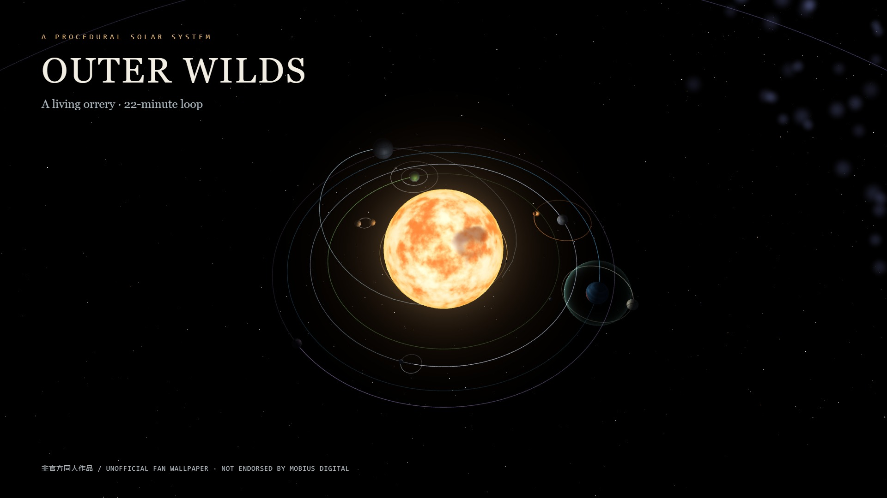

# Outer Wilds · 太阳系动态壁纸

非官方同人项目：程序化生成的 3D 太阳系，面向 Wallpaper Engine 的 Web 壁纸。

**0.2.1-dev · 本地预发布；尚未完成桌面验收，尚未上传 Workshop。**

[English](README.en.md) · [当前验收状态](STATUS.md) · [数据与署名](NOTICE.md)



## 先看这里

- 包含本体与 DLC 的天体和时间变化，**可能剧透**。
- 贴图全部由程序生成，不含游戏提取素材、音频、远程下载或遥测。
- 桌面交互标准为**拖动旋转 + 右下角按钮缩放/复位**（2026-09-19 用户确认桌面不转发滚轮，接受按钮方案）。横向桌面拖动与按钮点击均已实测有效；浏览器中滚轮仍可用。
- 这是太阳系模型，不包含地表探索、物理碰撞、对白或任务。

## 本地预览（无需安装依赖）

直接打开 `wallpaper/index.html`。需要硬件加速 WebGL2 的现代浏览器。

左键拖动环绕；浏览器滚轮缩放；右下角 `+` / `−` 按钮放大缩小，`⌂` 重置视角。中键拖动平移。浏览器还支持 Shift+拖动、H 切换调试信息、P 暂停、R 重置循环。WE 预览测试未收到键盘事件，请以鼠标和属性面板为主。

默认空闲 15 FPS、交互 30 FPS，仍受 WE 全局帧率上限约束。调试信息默认关闭。

## Wallpaper Engine

交付目录为 `wallpaper/`（打包后是 `dist/outerwilds-wallpaper-0.2.1-dev/`），项目入口为 `project.json`，页面为 `index.html`。保持目录完整，不要只复制 HTML。

本机已验证 WE 能从普通文件夹打开项目。使用官方命令行预览时，在 WE 运行后执行：

```text
wallpaper64.exe -control openWallpaper -file "<完整路径>/wallpaper/project.json" -playInWindow "Outer Wilds Preview" -width 1280 -height 720
```

切换正式桌面前先读源码中的 [桌面复测说明](spike/README.md)。更换壁纸、调整播放规则或隐藏图标应由使用者确认；本项目不会自动执行这些操作。

### 属性面板

| 设置 | 作用 |
|---|---|
| 交互/空闲帧率 | 绘制上限，同时遵守 WE 全局上限 |
| 时间倍率 | 0.25–10 倍速度 |
| 轨道线、星空亮度 | 视觉调节 |
| 真实比例 | 关闭视觉压缩，主要用于验证 |
| 轨道压缩、天体半径、局部轨道放大 | 调整观赏比例，半径受安全间隙约束 |
| 量子月驻留时间 | 最短状态变化间隔 |
| 暂停后恢复方式 | 默认冻结循环；可选跟随真实时间，在恢复时补齐 |
| 显示缩放按钮 | 桌面不转发滚轮时的鼠标备用控制 |
| 调试信息 | 模拟时间、事件、帧率和 GPU 信息 |

## 开发、测试与打包

Node.js 22+。核心构建和单元测试不需要第三方依赖。

- `npm run serve`：本地预览。
- `npm run verify`：重建数据和离线单文件包，运行测试。
- `npm run package`：校验后生成交付目录、文件哈希和验收状态；不会上传。
- `npm run test:browser`：可选真实浏览器验收。需另外安装 Playwright/Chromium，或用 `PLAYWRIGHT_MODULE` 和 `BROWSER_EXECUTABLE` 指定现有安装。
- `npm run preview:cover`：同时从实际场景生成 1920×1080 封面。

打包使用白名单，不包含本机日志、个人路径、测试探针和开发服务器。探针会请求本机接收器，但**不属于正式壁纸运行目录**。

### 版本管理

本项目处于默认只保留笔记的上层仓库内。本目录 `.gitignore` 已重新允许源码、原始数据、测试和工具进入版本管理，但不会自动提交。请仅暂存本项目，避免带入上层仓库其他改动。`dist/`、浏览器临时结果及本机日志不入库。

<details>
<summary>剧透：循环与模拟范围</summary>

循环为 1360 秒（22 分 40 秒），含主体循环和尾段。包括太阳变化、沙流、闯入者冰壳和撞日、超新星、星空消隐、量子月及部分 DLC 外观变化，白闪遮盖循环接缝。

OWClock 的 87 条事件选择实现 19 条，另外 68 条在数据中逐条说明弃置理由，不宣称复刻所有游戏事件。装饰效果由固定种子驱动。数据、近似与容差见源码中的 `PLAN.md` 和 `data/fits-report.md`。

</details>

## 已知限制

1. 桌面滚轮不可用属宿主限制，已按用户决定改用按钮；竖屏输入仍需单独验证。
2. 已有真实桌面长时参考数据和双屏短测，但空闲组中断、活跃组差0.83秒且一个GPU样本缺失；指定2560×1600及多屏长时验收仍未完成。性能不再设硬门槛，只记录实测值。
3. 默认暂停模式通过 WE 双屏 pause/play 短测；wall-clock、休眠和显卡恢复仍需更完整的真实宿主验收。
4. 无 WebGL2 时显示文字提示，未提供完整静态场景降级。
5. 发布前需重新核对官方同人政策并闭合 STATUS.md 中的验收项。

## 许可与免责

源码为 MIT，见 [LICENSE](LICENSE)。游戏名称、设定及相关知识产权不在该许可范围内。来源和署名见 [NOTICE.md](NOTICE.md)。

This work is unofficial Fan Content created under permission from the Mobius Digital Fan Content Policy. It includes materials which are the property of Mobius Digital and it is neither approved nor endorsed by Mobius Digital.
